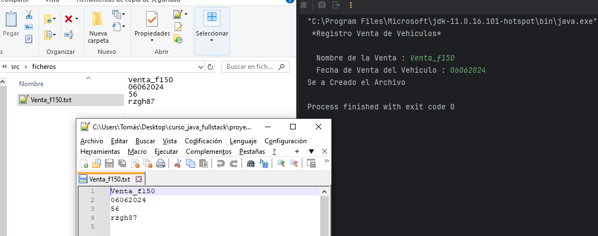

Desafío - Manejo de Excepciones
--

Requerimientos
Continuando el desafío anterior:
1. Crear la clase LibroVenta con los siguientes atributos.
   (2 Puntos)
   - nombreVenta: String.
   - fechaVenta: String //Ejemplo “01102020”.
2. Generar constructor con parámetros a la clase LibroVenta.
   (2 Puntos)
3. Crear los Accesadores y Seteadores para cada campo de la clase LibroVenta.
   (2 Puntos)
4. Crear una operación llamada guardar llamada guardarVenta a la clase LibroVenta.
   (2 Puntos)
5. Crear un directorio con nombre “ficheros” que contará con un archivo donde se
   guardará la patente del vehículo, la edad del cliente, la fecha de la venta y el nombre
   de venta. Este método recibe un atributo de tipo Cliente y un atributo de tipo
   Vehiculo.
   (2 Puntos)

Consideraciones y recomendaciones
--

Hint
--
- Aplicar lo aprendido en Arreglo y archivos.
- Validar que el archivo no exista.
- El archivo debe llamarse según el atributo “nombre venta” y tener extensión “.txt”.
- Guardar la fecha como número.
- Utilizar tantas exception sean necesarias.
- Utilizar Try-Catch.

Imagen del Proyecto

